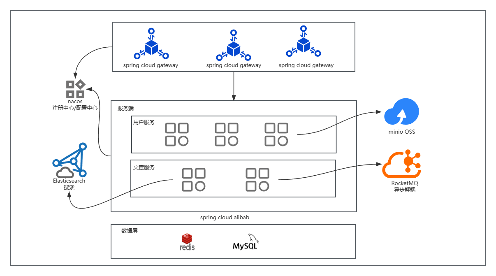
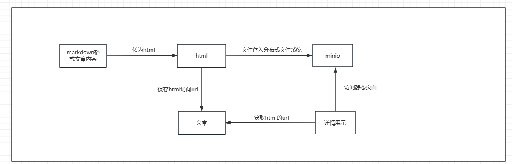

# zheyezhuanlan
zheye后端项目
## 架构图

## 文章静态化
在使用页面静态化之前，在后台需要大量的查询，而后渲染得到html页面，对数据库的压力比较大，并且请求的响应时间也比较长。
通常我们解决这样的问题都是缓存技术，把热点数据放入缓存中，但是也不是什么数据都要放入缓存的，比如商品的详情数据，
如果商品很多，数据量很大的时候， 占用的内存就比较大，此时会给缓存到来很大的压力。如果因为这个导致缓存崩溃，
那么就可能直接导致数据库崩溃。

缓存不是万能的，所以我们在一些场景下就选择使用静态化来解决，比如，商品详情页、新闻详情这些页面，
我们就可以通过静态化来优化。

## TODO
- Elasticsearch 文章搜索